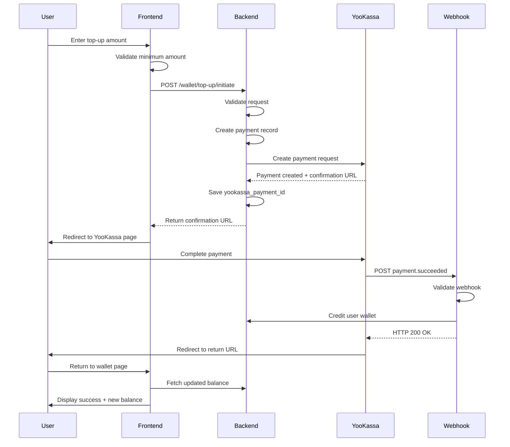
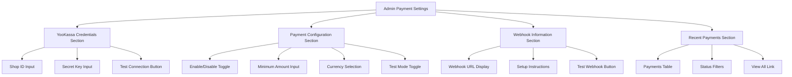
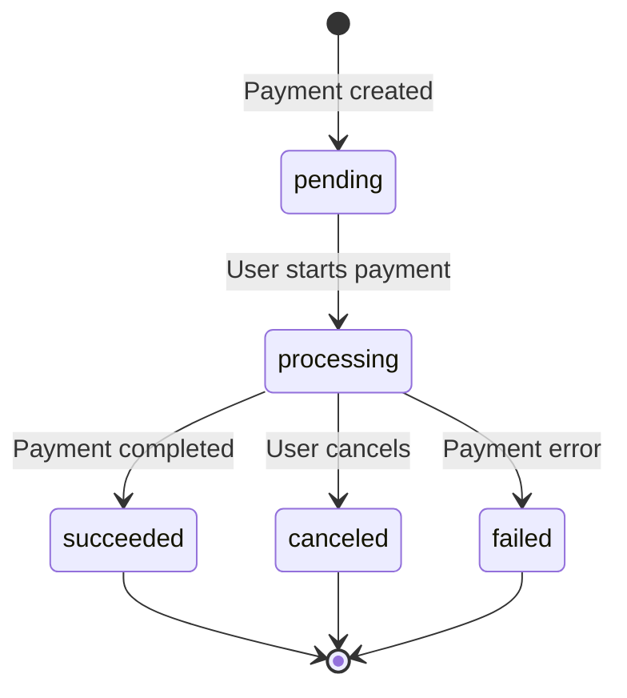

# YooKassa Payment Integration

## Overview

This design outlines the integration of YooKassa payment gateway into the Laravel-based shop system to enable balance top-up functionality. The integration will allow users to replenish their wallet balance through YooKassa's payment processing services, with proper webhook handling for payment status updates and an admin settings page for YooKassa API credentials configuration.

## Business Context

The current system uses the Bavix Wallet package for internal wallet management. Users can purchase products using wallet balance, but there is no automated way to add funds to the wallet. This integration bridges that gap by connecting to YooKassa, a popular Russian payment gateway, enabling automated balance replenishment.

## Core Objectives

1. Enable users to initiate balance top-up requests with configurable minimum amounts
2. Integrate YooKassa payment API for processing top-up transactions
3. Handle payment status webhooks to automatically credit user wallets upon successful payments
4. Provide admin interface for managing YooKassa API credentials and settings
5. Maintain transaction history and audit trail for all payment operations
6. Ensure idempotency and security for payment processing

## System Components

### YooKassa API Credentials Management

YooKassa API integration requires secure storage and management of sensitive credentials.

| Configuration Key | Description | Storage Type | Required |
|------------------|-------------|--------------|----------|
| yookassa_shop_id | YooKassa merchant shop identifier | Encrypted | Yes |
| yookassa_secret_key | YooKassa API secret key for authentication | Encrypted | Yes |
| yookassa_enabled | Feature toggle for YooKassa integration | Plain | Yes |
| yookassa_min_amount | Minimum top-up amount in rubles | Plain | Yes |
| yookassa_currency | Payment currency (default: RUB) | Plain | Yes |

The credentials will be stored using the existing SystemConfiguration model pattern, which provides encrypted storage for sensitive values and caching capabilities.

### Payment Flow Architecture

The payment flow consists of three distinct phases: initiation, processing, and confirmation.

#### Phase 1: Payment Initiation

When a user requests a balance top-up:

1. User enters desired top-up amount on the wallet page
2. Frontend validates minimum amount requirement
3. Backend validates the request and checks YooKassa configuration status
4. System creates a YooKassa payment request with redirect confirmation type
5. Backend stores pending payment record with status "pending"
6. System generates unique idempotency key for YooKassa API call
7. User is redirected to YooKassa payment page via confirmation URL

#### Phase 2: Payment Processing

The payment processing happens on YooKassa's side:

1. User completes payment on YooKassa hosted page
2. User selects payment method (bank card, SBP, YooMoney wallet, etc.)
3. YooKassa processes payment through selected payment method
4. Payment status transitions through YooKassa's internal states
5. User is redirected back to application via return URL

#### Phase 3: Payment Confirmation

Payment status updates are received via webhooks:

1. YooKassa sends webhook notification to configured endpoint
2. System validates webhook authenticity using IP whitelist and signature
3. Payment status is extracted from webhook payload
4. For successful payments (status: "succeeded"):
   - User wallet is credited with payment amount
   - Transaction record is created with payment metadata
   - Payment record status is updated to "completed"
5. For failed payments (status: "canceled"):
   - Payment record status is updated to "failed"
   - No wallet transaction is created
6. System sends HTTP 200 response to acknowledge webhook receipt

### Data Model Extensions

#### Payment Records Table

A new table will store all YooKassa payment attempts and their statuses.

| Column Name | Data Type | Purpose | Constraints |
|------------|-----------|---------|-------------|
| id | bigint | Primary key | Auto-increment |
| user_id | bigint | Reference to user who initiated payment | Foreign key, indexed |
| yookassa_payment_id | string | YooKassa's unique payment identifier | Unique, indexed |
| amount | decimal(10,2) | Payment amount in main currency unit | Positive value |
| currency | string | Currency code | Default: RUB |
| status | enum | Payment status | Values: pending, processing, succeeded, canceled, failed |
| payment_method_type | string | Payment method used | Nullable |
| confirmation_url | text | YooKassa payment page URL | Nullable |
| return_url | text | Application return URL after payment | Not null |
| idempotency_key | string | Unique key for request idempotency | Unique, indexed |
| yookassa_response | json | Full YooKassa API response | Nullable |
| metadata | json | Additional payment metadata | Nullable |
| paid_at | timestamp | Timestamp when payment succeeded | Nullable |
| created_at | timestamp | Payment initiation timestamp | Auto |
| updated_at | timestamp | Last status update timestamp | Auto |

The status field tracks the payment lifecycle:
- **pending**: Payment created, awaiting user action
- **processing**: Payment initiated by user, awaiting confirmation
- **succeeded**: Payment completed successfully, funds received
- **canceled**: Payment canceled by user or timeout
- **failed**: Payment processing failed due to error

### Backend Service Architecture

#### YooKassa Service Layer

A dedicated service class will encapsulate all YooKassa API interactions.

Service Responsibilities:
- Construct API requests with proper authentication
- Generate unique idempotency keys for each payment
- Make HTTP calls to YooKassa API endpoints
- Parse and normalize API responses
- Handle API errors and implement retry logic
- Validate webhook signatures and payloads

Key Service Methods:

| Method Name | Purpose | Input Parameters | Return Type |
|------------|---------|------------------|-------------|
| createPayment | Initiate new payment | amount, user, metadata | Payment object |
| getPaymentStatus | Retrieve payment status from YooKassa | yookassaPaymentId | Payment status data |
| validateWebhook | Verify webhook authenticity | request payload, headers | boolean |
| parseWebhookPayload | Extract payment data from webhook | webhook payload | normalized payment data |
| isConfigured | Check if YooKassa credentials are set | none | boolean |

#### Payment Controller

A new controller will handle payment-related user requests.

Controller Endpoints:

| Route | Method | Purpose | Auth Required |
|-------|--------|---------|---------------|
| /wallet/top-up/initiate | POST | Create YooKassa payment and redirect user | Yes |
| /wallet/top-up/callback | GET | Handle return from YooKassa page | Yes |
| /wallet/top-up/history | GET | Retrieve user's payment history | Yes |
| /api/yookassa/webhook | POST | Receive YooKassa payment notifications | No (IP whitelist) |

Request/Response Flow for Payment Initiation:

**Request Body:**
| Field | Type | Validation | Description |
|-------|------|------------|-------------|
| amount | number | min: config value, max: 1000000 | Top-up amount in rubles |

**Success Response:**
| Field | Type | Description |
|-------|------|-------------|
| success | boolean | Operation success indicator |
| payment_id | string | Internal payment record ID |
| confirmation_url | string | YooKassa payment page URL |

**Error Response:**
| Field | Type | Description |
|-------|------|-------------|
| success | boolean | Always false |
| error | string | Human-readable error message |
| error_code | string | Machine-readable error code |

#### Webhook Processing Controller

Webhook handling requires special security considerations.

Webhook Security Measures:
1. IP address whitelist validation against YooKassa notification servers
2. Request signature validation using secret key
3. Idempotency checks to prevent duplicate processing
4. Rate limiting to prevent abuse

Webhook Processing Logic:

1. Validate request origin (IP whitelist)
2. Verify request signature
3. Parse webhook event type and payment object
4. Load payment record by yookassa_payment_id
5. Check if payment status requires action
6. Begin database transaction
7. Update payment record status
8. For succeeded status: create wallet deposit transaction
9. Commit transaction
10. Return HTTP 200 OK response

Error Handling Strategy:
- Invalid signature: Return HTTP 401 Unauthorized
- Payment not found: Log warning, return HTTP 200 (already processed)
- Database error: Return HTTP 500 (YooKassa will retry)
- Duplicate webhook: Return HTTP 200 (idempotent handling)

### Admin Configuration Interface

#### Admin Settings Page

A new admin page will allow administrators to configure YooKassa integration settings.

Page Structure:

**Section 1: YooKassa Credentials**
- Shop ID input field with validation
- Secret Key input field (password type, masked display)
- Test connection button to verify credentials
- Connection status indicator

**Section 2: Payment Settings**
- Enable/Disable YooKassa toggle switch
- Minimum top-up amount input (numeric, positive)
- Currency selection (default: RUB, can support others)
- Test mode toggle for using YooKassa sandbox

**Section 3: Webhook Configuration**
- Display webhook URL for copying to YooKassa dashboard
- Webhook setup instructions
- Webhook test trigger button

**Section 4: Recent Payments**
- Table showing last 10 payments across all users
- Columns: User, Amount, Status, Payment Method, Date
- Quick filters by status
- Link to full payment reports

Settings Validation Rules:

| Field | Validation Rules |
|-------|-----------------|
| Shop ID | Required, alphanumeric, 5-20 characters |
| Secret Key | Required, minimum 20 characters |
| Minimum Amount | Required, numeric, positive, minimum 1 RUB |
| Currency | Required, 3-letter currency code |

#### Admin Routes

New routes in the admin panel:

| Route | Method | Permission | Purpose |
|-------|--------|-----------|---------|
| /admin/payment/settings | GET | manage-wallets | Display YooKassa settings page |
| /admin/payment/settings | POST | manage-wallets | Save YooKassa configuration |
| /admin/payment/test-connection | POST | manage-wallets | Test YooKassa API credentials |
| /admin/payment/payments | GET | manage-wallets | View all payments across users |

### Frontend Implementation

#### Wallet Page Enhancements

The existing wallet page will be enhanced with YooKassa payment integration.

UI Components to Add:

**Top-Up Section:**
- Amount input field with currency symbol
- Payment method selector (display available YooKassa methods)
- Minimum amount hint text
- Top-up button that redirects to YooKassa
- Loading state during payment creation

**Payment History Enhancement:**
- Add "Top-Up" transaction type to history
- Display payment method icon for top-ups
- Show payment status badge (pending, completed, failed)
- Link to YooKassa receipt if available

#### User Flow Diagrams

#### Admin Settings Page Structure

### Transaction Flow and State Management

#### Payment State Machine

The payment lifecycle follows a defined state machine.

State Transition Rules:
- **pending**: Initial state when payment record is created
- **processing**: Automatically set when user is redirected to YooKassa
- **succeeded**: Only set via webhook, triggers wallet credit
- **canceled**: Set via webhook when user cancels or payment expires
- **failed**: Set via webhook when payment processing fails

#### Idempotency Handling

To prevent duplicate payments and wallet credits:

1. Generate unique idempotency key for each payment (UUID v4)
2. Send idempotency key in YooKassa API request header
3. Store idempotency key in payment record
4. On webhook receipt, check if payment already processed
5. Skip wallet credit if payment status already "succeeded"
6. Always return HTTP 200 to prevent YooKassa retries

### Security Considerations

#### Payment Security

| Security Aspect | Implementation Approach |
|----------------|------------------------|
| API Credentials | Store encrypted in database using SystemConfiguration |
| Webhook Authentication | Validate IP whitelist + signature verification |
| CSRF Protection | Apply CSRF middleware to user-facing endpoints |
| Amount Validation | Server-side validation of min/max amounts |
| Idempotency | Unique keys prevent duplicate processing |
| User Authorization | Verify payment ownership before showing details |

#### YooKassa IP Whitelist

YooKassa webhooks originate from specific IP ranges. The webhook endpoint should validate the source IP against YooKassa's documented IP addresses:
- 185.71.76.0/27
- 185.71.77.0/27
- 77.75.153.0/25
- 77.75.156.11
- 77.75.156.35
- 77.75.154.128/25
- 2a02:5180::/32

Requests from other IPs should be rejected with HTTP 403 Forbidden.

### Error Handling and Recovery

#### User-Facing Errors

| Error Scenario | User Message | Action |
|---------------|-------------|--------|
| YooKassa disabled | Payment system is temporarily unavailable | Show contact support |
| Amount below minimum | Minimum top-up amount is X RUB | Show minimum requirement |
| YooKassa API error | Unable to create payment, try again | Retry button |
| Payment canceled | Payment was canceled | Return to wallet page |
| Payment failed | Payment could not be processed | Contact support |

#### Admin Errors

| Error Scenario | Admin Message | Resolution |
|---------------|--------------|------------|
| Invalid credentials | YooKassa API authentication failed | Check Shop ID and Secret Key |
| Network error | Cannot connect to YooKassa API | Check network/firewall |
| Webhook signature invalid | Webhook authentication failed | Verify secret key configuration |
| Missing configuration | YooKassa is not configured | Complete settings form |

#### Monitoring and Logging

Events to Log:
- Payment creation requests with user ID and amount
- YooKassa API responses with payment ID
- Webhook receipts with event type and payment status
- Wallet credit operations with transaction ID
- Payment status transitions with timestamps
- API errors with full error details

Log Levels:
- **INFO**: Normal payment flow events
- **WARNING**: Payment cancellations, expired payments
- **ERROR**: API failures, webhook validation failures
- **CRITICAL**: Wallet credit failures after successful payment

### Integration with Existing Wallet System

#### Wallet Transaction Creation

When a payment succeeds, a wallet deposit transaction is created:

| Transaction Field | Value Source |
|------------------|--------------|
| user_id | From payment record |
| type | "deposit" |
| amount | Payment amount in cents (multiply by 100) |
| confirmed | true |
| meta | JSON with yookassa_payment_id, payment_method, description |

Transaction Metadata Example:
| Key | Value Example | Purpose |
|-----|--------------|---------|
| source | "yookassa" | Identify deposit source |
| yookassa_payment_id | "2d2d8aa1-000f-5000-8000-..." | Link to YooKassa payment |
| payment_method | "bank_card" | Record payment method used |
| description | "Пополнение баланса через ЮКасса" | User-friendly description |
| admin_user_name | null | Distinguish from admin deposits |

#### Balance Update Flow

The wallet credit operation follows this sequence:

1. Webhook validated and payment status is "succeeded"
2. Begin database transaction
3. Load user model with wallet relation
4. Call user wallet deposit method with amount
5. Wallet balance incremented automatically by Bavix package
6. Transaction record created by Bavix package
7. Update payment record status to "succeeded"
8. Set payment paid_at timestamp
9. Commit database transaction
10. Fire balance updated event for notifications

### Localization Requirements

#### Language Keys for Russian (ru)

New translation keys to add:

| Translation Key | Russian Text |
|----------------|-------------|
| wallet.yookassa.title | Пополнение через ЮКассу |
| wallet.yookassa.description | Пополните баланс банковской картой, СБП или электронными кошельками |
| wallet.yookassa.min_amount | Минимальная сумма пополнения: :amount ₽ |
| wallet.yookassa.processing | Обработка платежа... |
| wallet.yookassa.redirect | Сейчас вы будете перенаправлены на страницу оплаты |
| wallet.yookassa.success | Баланс успешно пополнен на :amount ₽ |
| wallet.yookassa.pending | Платеж ожидает подтверждения |
| wallet.yookassa.failed | Не удалось выполнить платеж |
| wallet.yookassa.canceled | Платеж был отменен |
| admin.payment.title | Настройки оплаты |
| admin.payment.yookassa_settings | Настройки ЮКассы |
| admin.payment.shop_id | Идентификатор магазина |
| admin.payment.secret_key | Секретный ключ |
| admin.payment.enabled | Включить ЮКассу |
| admin.payment.min_amount | Минимальная сумма |
| admin.payment.test_connection | Проверить подключение |
| admin.payment.connection_success | Подключение успешно |
| admin.payment.connection_failed | Ошибка подключения |

#### Language Keys for English (en)

| Translation Key | English Text |
|----------------|-------------|
| wallet.yookassa.title | Top Up via YooKassa |
| wallet.yookassa.description | Top up your balance using bank cards, SBP, or e-wallets |
| wallet.yookassa.min_amount | Minimum top-up amount: :amount ₽ |
| wallet.yookassa.processing | Processing payment... |
| wallet.yookassa.redirect | You will be redirected to the payment page |
| wallet.yookassa.success | Balance topped up by :amount ₽ |
| wallet.yookassa.pending | Payment is pending confirmation |
| wallet.yookassa.failed | Payment could not be processed |
| wallet.yookassa.canceled | Payment was canceled |
| admin.payment.title | Payment Settings |
| admin.payment.yookassa_settings | YooKassa Settings |
| admin.payment.shop_id | Shop ID |
| admin.payment.secret_key | Secret Key |
| admin.payment.enabled | Enable YooKassa |
| admin.payment.min_amount | Minimum Amount |
| admin.payment.test_connection | Test Connection |
| admin.payment.connection_success | Connection successful |
| admin.payment.connection_failed | Connection failed |

### Testing Strategy

#### Manual Testing Checklist

**Payment Creation Flow:**
- [ ] User can initiate payment with valid amount
- [ ] Validation prevents amounts below minimum
- [ ] Payment record is created with pending status
- [ ] User is redirected to YooKassa page
- [ ] YooKassa page displays correct amount and currency

**Payment Completion Flow:**
- [ ] Successful payment triggers webhook
- [ ] Webhook validates correctly
- [ ] User wallet is credited with payment amount
- [ ] Payment status updates to succeeded
- [ ] User sees updated balance on return

**Payment Failure Flow:**
- [ ] Canceled payment updates status correctly
- [ ] Failed payment does not credit wallet
- [ ] User receives appropriate error message
- [ ] Payment record reflects failed status

**Admin Configuration:**
- [ ] Admin can save YooKassa credentials
- [ ] Credentials are stored encrypted
- [ ] Test connection validates credentials
- [ ] Settings page displays current configuration
- [ ] Webhook URL is displayed correctly

#### Test Mode Configuration

YooKassa provides a test mode for development:

1. Use test shop credentials from YooKassa dashboard
2. Enable test mode in admin settings
3. Use test bank card numbers for payments:
   - Success: 1111 1111 1111 1026
   - Failure: 5555 5555 5555 4444
4. Webhook notifications work identically in test mode
5. Test payments are marked with "test": true in API response

### Migration and Deployment

#### Database Migration Steps

Migration should create the payments table and add configuration entries:

Migration Tasks:
1. Create yookassa_payments table with all required columns
2. Add indexes on user_id, yookassa_payment_id, status, created_at
3. Add foreign key constraint to users table
4. Add default SystemConfiguration entries for YooKassa settings
5. Set default values: enabled=false, min_amount=100, currency=RUB

Rollback Considerations:
- Dropping the table will lose payment history
- Recommendation: archive payment data before rollback
- Configuration entries can be safely removed

#### Deployment Checklist

Pre-Deployment:
- [ ] Create YooKassa merchant account
- [ ] Obtain shop ID and secret key from YooKassa dashboard
- [ ] Configure webhook URL in YooKassa dashboard
- [ ] Whitelist server IP if using YooKassa IP restrictions
- [ ] Test credentials in YooKassa test mode

Post-Deployment:
- [ ] Run database migrations
- [ ] Configure YooKassa credentials in admin panel
- [ ] Test payment creation in test mode
- [ ] Verify webhook receipt and processing
- [ ] Test complete payment flow end-to-end
- [ ] Enable production mode in YooKassa settings
- [ ] Monitor logs for first production payments

### Performance Considerations

#### Caching Strategy

| Cached Data | Cache Duration | Invalidation Trigger |
|------------|----------------|---------------------|
| YooKassa configuration | 1 hour | Settings update |
| User payment history | 5 minutes | New payment created |
| Payment status | None | Real-time via webhook |

#### Database Optimization

Recommended Indexes:
- yookassa_payments.user_id (frequent filtering by user)
- yookassa_payments.yookassa_payment_id (webhook lookups)
- yookassa_payments.status (admin filtering)
- yookassa_payments.created_at (sorting, pagination)
- yookassa_payments.idempotency_key (duplicate prevention)

Query Optimization:
- Eager load user relations when fetching payments
- Use pagination for payment history (limit 50 per page)
- Implement cursor-based pagination for large datasets
- Cache payment statistics for admin dashboard

#### Webhook Performance

Webhook processing should be fast to prevent timeouts:

Target Performance Metrics:
- Webhook acknowledgment: < 500ms
- Database transaction: < 200ms
- Total webhook processing: < 1 second

Optimization Techniques:
- Process webhook synchronously (fast enough for YooKassa)
- Use database transactions to ensure atomicity
- Defer non-critical tasks (emails, notifications) to queue
- Log webhook payload for debugging without blocking response

### Future Enhancements

Potential future improvements not included in this phase:

1. **Recurring Payments**: Allow users to save payment methods for faster top-ups
2. **Payment Methods Display**: Show available payment methods before redirect
3. **Payment Analytics**: Admin dashboard with payment metrics and charts
4. **Automatic Refunds**: Handle refund requests through admin panel
5. **Multi-Currency Support**: Accept payments in USD, EUR alongside RUB
6. **Payment Limits**: Set per-user daily/monthly top-up limits
7. **Promotional Bonuses**: Add bonus balance for specific top-up amounts
8. **Email Notifications**: Send receipts and confirmations via email
9. **Mobile App Integration**: Deep linking back to mobile app after payment
10. **Payment Method Preferences**: Remember user's preferred payment method

### Technical Dependencies

Required PHP Packages:
- Laravel HTTP Client (included in Laravel)
- No additional PHP package required (direct API integration)

Required NPM Packages:
- No additional packages required (using existing UI components)

Environment Variables:
| Variable Name | Purpose | Example Value |
|--------------|---------|---------------|
| YOOKASSA_WEBHOOK_IP_CHECK | Enable/disable IP validation | true |
| YOOKASSA_RETURN_URL | Default return URL after payment | https://example.com/wallet |

External Service Dependencies:
- YooKassa API (api.yookassa.ru)
- Requires HTTPS for webhook endpoint
- Stable internet connection for API calls

### Documentation Requirements

Documentation to Create:
1. Admin user guide for configuring YooKassa
2. Developer guide for YooKassa service class usage
3. Webhook troubleshooting guide
4. Payment status reference table
5. API endpoint documentation for payment routes

Admin Setup Instructions:
1. Register merchant account on yookassa.ru
2. Complete business verification process
3. Navigate to admin payment settings page
4. Enter shop ID and secret key
5. Set minimum top-up amount
6. Click "Test Connection" to verify
7. Copy webhook URL to YooKassa dashboard
8. Save settings and enable YooKassa
9. Perform test payment to verify integration

### Acceptance Criteria

The implementation is complete when:

1. Users can initiate balance top-up with YooKassa payment
2. Users are redirected to YooKassa payment page with correct amount
3. Successful payments automatically credit user wallets
4. Failed/canceled payments are tracked without crediting wallets
5. Admin can configure YooKassa credentials securely
6. Admin settings page displays webhook URL and setup instructions
7. Webhook endpoint validates requests and processes payments
8. All payment events are logged for auditing
9. Payment history is visible on user wallet page
10. Localization is complete for Russian and English languages
11. All database migrations run successfully
12. Error handling covers all failure scenarios
13. Security measures are implemented (encryption, validation, authorization)
14. Integration works in both test and production modes

### Risk Assessment

| Risk | Impact | Mitigation Strategy |
|------|--------|-------------------|
| Webhook delivery failure | High | YooKassa automatically retries failed webhooks |
| Duplicate payment processing | High | Implement idempotency checks and database constraints |
| API credentials exposure | Critical | Store encrypted, never log in plaintext |
| Payment amount mismatch | Medium | Server-side validation, amount confirmation UI |
| Network timeout during payment | Low | User can check wallet page for updated balance |
| YooKassa service downtime | Medium | Display user-friendly error, suggest retry later |
| Webhook IP spoofing | Medium | Validate webhook source IP and signature |
| Race condition on wallet credit | Medium | Use database transactions and locking |

### Compliance and Regulations

Considerations for payment processing:

**Data Privacy:**
- Do not store full card numbers (handled by YooKassa)
- Store only masked card data from API response
- Apply GDPR/PDP compliance for user payment data
- Provide ability for users to delete payment history

**Financial Regulations:**
- YooKassa handles PCI DSS compliance
- Maintain audit trail of all transactions
- Ensure transaction traceability via payment IDs
- Store transaction metadata for accounting purposes

**Tax Requirements:**
- Payment amounts should match invoice amounts
- Store payment receipts from YooKassa
- Provide transaction exports for accounting
- Link payments to user tax information if required- Provide transaction exports for accounting
- Link payments to user tax information if required
