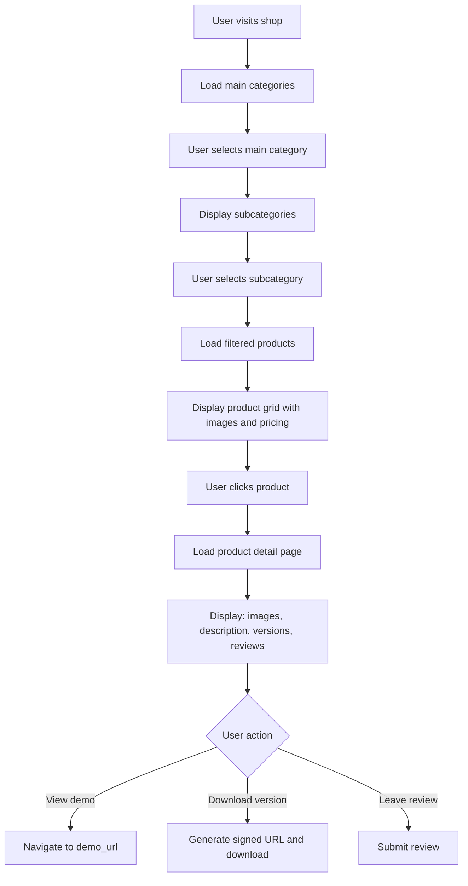
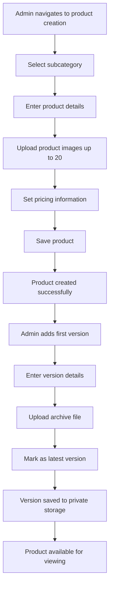
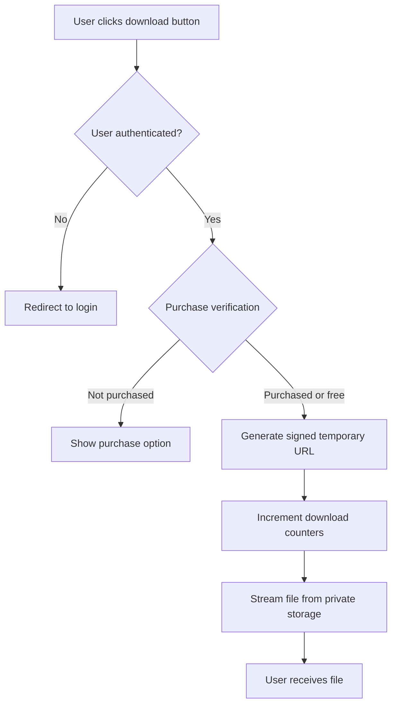
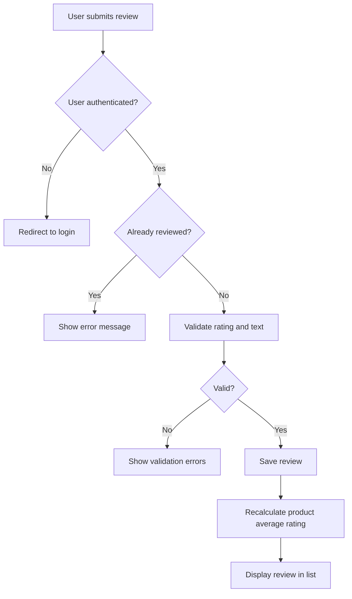

# Product Management System Design

## Overview

This design document outlines a comprehensive product management system for the GCMS Shop platform. The system enables administrators to manage products, categories, and product versions with full version control, file management, and user reviews. The implementation leverages the existing Laravel + React (Inertia.js) architecture with Spatie Permissions for granular access control.

## Business Context

The product management system serves as the core catalog functionality for the GCMS Shop platform, enabling:

- Hierarchical category organization with main categories and subcategories
- Comprehensive product information including descriptions, images, and versioning
- Secure file storage for product archives and downloads
- Version tracking with changelog management
- Customer reviews and ratings for products
- Download and view analytics

## Core Entities

### Main Category

**Purpose**: Represents the top-level classification of products within the system.

**Attributes**:

| Attribute | Type | Constraints | Description |
|-----------|------|-------------|-------------|
| id | Integer | Primary Key, Auto-increment | Unique identifier |
| name | String | Required, Max 255 characters | Display name of the category |
| slug | String | Required, Unique, Max 255 characters | URL-friendly identifier |
| created_at | Timestamp | Auto-managed | Record creation timestamp |
| updated_at | Timestamp | Auto-managed | Record modification timestamp |

**Business Rules**:
- The slug must be automatically generated from the name but can be manually overridden
- Deleting a main category should cascade to all related subcategories and their products (or prevent deletion if subcategories exist)
- Only administrators with the `edit-categories` permission can create, update, or delete main categories

### Subcategory

**Purpose**: Provides granular classification within main categories, enabling more specific product organization.

**Attributes**:

| Attribute | Type | Constraints | Description |
|-----------|------|-------------|-------------|
| id | Integer | Primary Key, Auto-increment | Unique identifier |
| name | String | Required, Max 255 characters | Display name of the subcategory |
| slug | String | Required, Unique within main category, Max 255 characters | URL-friendly identifier |
| main_category_id | Integer | Foreign Key, Required | Reference to parent main category |
| created_at | Timestamp | Auto-managed | Record creation timestamp |
| updated_at | Timestamp | Auto-managed | Record modification timestamp |

**Relationships**:
- Belongs to one Main Category
- Has many Products

**Business Rules**:
- The slug must be unique within the scope of its main category
- Only administrators with the `edit-categories` permission can manage subcategories
- Deleting a subcategory should either cascade to products or prevent deletion if products exist

### Product

**Purpose**: Represents the core sellable/downloadable item with comprehensive metadata, media, and versioning capabilities.

**Attributes**:

| Attribute | Type | Constraints | Description |
|-----------|------|-------------|-------------|
| id | Integer | Primary Key, Auto-increment | Unique identifier |
| slug | String | Required, Unique, Max 255 characters | URL-friendly identifier |
| subcategory_id | Integer | Foreign Key, Required | Reference to parent subcategory |
| short_description | Text | Required | Plain text summary of the product |
| long_description | Text | Required | Markdown-formatted detailed description |
| current_price | Decimal | Required, Precision 10,2, Min 0 | Active selling price |
| original_price | Decimal | Nullable, Precision 10,2, Min 0 | Previous price (for discount display) |
| author | String | Required, Max 255 characters | Creator/author name (manual input) |
| demo_url | String | Nullable, Max 2048 characters | URL to live demonstration |
| view_count | Integer | Default 0, Min 0 | Number of product page views |
| download_count | Integer | Default 0, Min 0 | Total downloads across all versions |
| created_at | Timestamp | Auto-managed | Product creation timestamp |
| updated_at | Timestamp | Auto-managed | Product modification timestamp |

**Relationships**:
- Belongs to one Subcategory
- Has many Product Images (up to 20)
- Has many Product Versions
- Has many Product Reviews

**Business Rules**:
- The slug must be globally unique across all products
- View count increments on each unique product page visit
- Download count increments when any version is downloaded
- Only administrators with the `edit-products` permission can create, update, or delete products
- When `original_price` is set and greater than `current_price`, display as discounted
- The `long_description` must be rendered as Markdown in the frontend

### Product Image

**Purpose**: Manages the visual media associated with products, supporting up to 20 images per product.

**Implementation Strategy**: Use Spatie Laravel Media Library for robust file handling, storage flexibility, and automatic image optimization.

**Attributes**:

| Attribute | Type | Constraints | Description |
|-----------|------|-------------|-------------|
| id | Integer | Primary Key, Auto-increment | Unique identifier (managed by Media Library) |
| product_id | Integer | Foreign Key, Required | Reference to parent product |
| file_name | String | Required | Original uploaded filename |
| mime_type | String | Required | Image MIME type |
| size | Integer | Required | File size in bytes |
| order | Integer | Default 0 | Display order position |
| collection_name | String | Fixed value: 'product_images' | Media Library collection identifier |

**Relationships**:
- Belongs to one Product

**Business Rules**:
- Maximum 20 images per product
- Supported formats: JPEG, PNG, WebP, GIF
- Maximum individual file size: 10MB
- Images should be optimized automatically upon upload
- Generate responsive image conversions (thumbnail, medium, large)
- First image (order = 0) serves as the primary product image
- Images stored on the configured media disk (public storage for accessibility)

**Media Conversions**:
- **thumbnail**: 150x150px, cropped to center
- **medium**: 600x400px, maintaining aspect ratio
- **large**: 1200x800px, maintaining aspect ratio

### Product Version

**Purpose**: Tracks different releases of a product, enabling version history, changelogs, and file distribution.

**Attributes**:

| Attribute | Type | Constraints | Description |
|-----------|------|-------------|-------------|
| id | Integer | Primary Key, Auto-increment | Unique identifier |
| product_id | Integer | Foreign Key, Required | Reference to parent product |
| version_number | String | Required, Max 50 characters | Semantic version (e.g., "1.0", "2.3.1") |
| version_name | String | Required, Max 255 characters | Human-readable version name |
| short_description | Text | Required, Markdown | Brief summary of changes |
| full_changelog | Text | Required, Markdown | Comprehensive changelog |
| download_count | Integer | Default 0, Min 0 | Downloads specific to this version |
| is_latest | Boolean | Default false | Marks the current release |
| created_at | Timestamp | Auto-managed | Version release timestamp |
| updated_at | Timestamp | Auto-managed | Version modification timestamp |

**File Storage**:
- Archive file managed via Spatie Media Library
- Collection name: 'product_archives'
- Storage disk: 'local' (private storage for security)
- File access controlled via signed temporary URLs
- Maximum file size: 500MB

**Relationships**:
- Belongs to one Product
- Has one Product Archive File (via Media Library)

**Business Rules**:
- Only one version can be marked as `is_latest = true` per product
- When a new version is marked as latest, all other versions for that product must be set to `is_latest = false`
- Version numbers should follow semantic versioning but allow flexibility
- Archive files must be stored privately to prevent unauthorized access
- Download links must be generated as temporary signed URLs with expiration
- Download count for the version and parent product both increment on successful download
- Only administrators with the `edit-products` permission can create or update versions

### Product Review

**Purpose**: Enables users to provide feedback and ratings for products they have purchased or interacted with.

**Implementation Strategy**: Use BeyondCode Laravel Comments package, extended with rating functionality.

**Attributes**:

| Attribute | Type | Constraints | Description |
|-----------|------|-------------|-------------|
| id | Integer | Primary Key, Auto-increment | Unique identifier |
| product_id | Integer | Foreign Key, Required | Reference to reviewed product |
| user_id | Integer | Foreign Key, Required | Reference to reviewer |
| rating | Integer | Required, Min 0, Max 5 | Star rating (0-5) |
| review_text | Text | Required | Review content |
| created_at | Timestamp | Auto-managed | Review submission timestamp |
| updated_at | Timestamp | Auto-managed | Review modification timestamp |

**Relationships**:
- Belongs to one Product
- Belongs to one User

**Business Rules**:
- Users can only submit one review per product
- Users cannot edit reviews after submission (immutable)
- Users can delete their own reviews
- Administrators with the `manage-reviews` permission can delete any review
- Reviews are displayed in chronological order (newest first)
- Average rating calculated across all reviews for display on product pages

## Authorization & Permissions

### Required New Permissions

The following permissions must be added to the existing Spatie Permission system:

| Permission Name | Description | Assigned Roles |
|----------------|-------------|----------------|
| manage-reviews | Delete any product review | Admin |

### Existing Permissions Usage

The following existing permissions will be utilized:

| Permission Name | Usage Context |
|----------------|---------------|
| edit-categories | Create, update, delete main categories and subcategories |
| edit-products | Create, update, delete products, versions, and images |
| view-products-categories | View products and categories (all users) |

### Access Control Rules

**Category Management**:
- View: All users with `view-products-categories` permission
- Create/Update/Delete: Administrators with `edit-categories` permission

**Product Management**:
- View: All users with `view-products-categories` permission
- Create/Update/Delete: Administrators with `edit-products` permission
- Download: Authenticated users (may require purchase verification in future)

**Review Management**:
- Create: Authenticated users
- Delete Own: Review author
- Delete Any: Administrators with `manage-reviews` permission

## Data Flow Patterns

### Product Browsing Flow

### Product Creation Flow

### Version Download Flow

### Review Submission Flow

## File Storage Architecture

### Storage Strategy

The system employs a dual-storage approach to balance security and accessibility:

**Public Storage** (for product images):
- Disk: `public` (Laravel filesystem)
- Path: `storage/app/public/media/products`
- Access: Direct URL access for performance
- Use case: Product images, thumbnails, gallery images

**Private Storage** (for product archives):
- Disk: `local` (Laravel filesystem)
- Path: `storage/app/private/media/archives`
- Access: Signed temporary URLs only
- Use case: Downloadable product versions, premium files

### File Access Control

**Product Images**:
- Publicly accessible via direct URLs
- Optimized with automatic conversions
- Served via Laravel's symbolic link or CDN

**Product Archives**:
- Never directly accessible
- Downloads served through controller action
- Temporary signed URLs with 60-minute expiration
- Download authorization verified before URL generation
- File streaming with proper headers for large files

### Storage Configuration

The Media Library will be configured to use different disks for different media collections:

| Collection | Disk | Visibility | Max Size |
|------------|------|------------|----------|
| product_images | public | public | 10MB per file |
| product_archives | local | private | 500MB per file |

## User Interface Considerations

### Category Navigation

**Sidebar/Navigation Structure**:
- Display main categories as expandable sections
- Show subcategories beneath each main category
- Highlight active category/subcategory
- Display product count per subcategory

### Product Listing

**Grid View**:
- Display primary product image (first in order)
- Show product name, author, and pricing
- Indicate discount with strikethrough original price
- Display average rating and review count
- Show "View Demo" link if demo_url exists

### Product Detail Page

**Layout Sections**:
1. **Image Gallery**: 
   - Large primary image with thumbnail navigation
   - Lightbox functionality for full-screen viewing
   
2. **Product Information**:
   - Product name and author
   - Pricing with discount indication
   - Short description (plain text)
   - Action buttons: View Demo, Download Latest
   
3. **Detailed Description**:
   - Render long_description as formatted Markdown
   
4. **Version History**:
   - Tabular list of all versions
   - Columns: Version number, Name, Release date, Downloads
   - Download button per version
   - Expandable changelog per version
   
5. **Reviews Section**:
   - Display average rating and total review count
   - Star rating histogram
   - Chronological list of reviews
   - Review submission form (if authenticated and not reviewed)

### Admin Product Management Interface

**Product List View**:
- Filterable by category, subcategory
- Searchable by name, author, slug
- Sortable by date, downloads, views
- Bulk actions for status management

**Product Edit Form**:
- Multi-step form or tabbed interface
- Sections: Basic Info, Images, Pricing, Versions
- Image upload with drag-and-drop reordering
- Version management with inline add/edit

## Data Validation Rules

### Main Category

| Field | Rules |
|-------|-------|
| name | Required, String, Max 255, Unique |
| slug | Required, String, Max 255, Unique, Alpha-dash |

### Subcategory

| Field | Rules |
|-------|-------|
| name | Required, String, Max 255 |
| slug | Required, String, Max 255, Alpha-dash, Unique within main_category_id |
| main_category_id | Required, Integer, Exists in main_categories |

### Product

| Field | Rules |
|-------|-------|
| slug | Required, String, Max 255, Unique, Alpha-dash |
| subcategory_id | Required, Integer, Exists in subcategories |
| short_description | Required, String, Max 1000 |
| long_description | Required, String |
| current_price | Required, Numeric, Min 0, Max 9999999.99 |
| original_price | Nullable, Numeric, Min 0, Max 9999999.99, Greater than current_price |
| author | Required, String, Max 255 |
| demo_url | Nullable, URL, Max 2048 |
| images | Array, Max 20 items, Each: Image file, Max 10MB, MIME types: jpeg, png, webp, gif |

### Product Version

| Field | Rules |
|-------|-------|
| product_id | Required, Integer, Exists in products |
| version_number | Required, String, Max 50 |
| version_name | Required, String, Max 255 |
| short_description | Required, String, Max 1000 |
| full_changelog | Required, String |
| archive_file | Required on creation, File, Max 500MB, MIME types: zip, rar, tar.gz |
| is_latest | Boolean |

### Product Review

| Field | Rules |
|-------|-------|
| product_id | Required, Integer, Exists in products |
| user_id | Required, Integer, Exists in users, Unique combination with product_id |
| rating | Required, Integer, Min 0, Max 5 |
| review_text | Required, String, Min 10, Max 2000 |

## Technical Implementation Notes

### Database Indexing Strategy

**Performance-Critical Indexes**:
- Main Categories: `slug` (unique index)
- Subcategories: `slug, main_category_id` (composite unique), `main_category_id` (foreign key index)
- Products: `slug` (unique index), `subcategory_id` (foreign key index)
- Product Versions: `product_id, is_latest` (composite index), `product_id` (foreign key index)
- Product Reviews: `product_id` (foreign key index), `user_id, product_id` (composite unique)

### Counters and Statistics

**View Counter Implementation**:
- Track unique views using session or cookie-based mechanism
- Avoid incrementing on bot traffic
- Update asynchronously or via queue for performance

**Download Counter Implementation**:
- Increment atomically during file access
- Update both version-specific and product-level counters
- Prevent double-counting via download session tracking

**Average Rating Calculation**:
- Calculate on-demand or cache with automatic invalidation
- Recalculate when reviews are added or deleted
- Store cached value in product model or cache layer

### Media Library Integration

**Package**: `spatie/laravel-medialibrary`

**Key Configurations**:
- Define custom path generator for organized storage
- Configure image conversions for responsive images
- Enable queue processing for large file uploads
- Set up temporary URL generation for private files

**Model Traits**:
- Product model implements `HasMedia` interface
- Product Version model implements `HasMedia` interface
- Register media collections and conversions in model

### Review System Integration

**Package**: `beyondcode/laravel-comments`

**Customizations**:
- Extend base Comment model to add `rating` field
- Disable comment approval workflow (auto-approve all reviews)
- Implement single review per user per product constraint
- Disable editing functionality (immutable reviews)

### URL Generation

**Product URLs**:
- Pattern: `/products/{category_slug}/{subcategory_slug}/{product_slug}`
- Enables SEO-friendly routing
- Breadcrumb navigation support

**Download URLs**:
- Generated as signed temporary URLs
- Expiration: 60 minutes
- Validation: Product access rights, authentication

## API Endpoints Structure

### Public Endpoints

| Method | Path | Purpose | Response |
|--------|------|---------|----------|
| GET | /api/categories | List all main categories with subcategories | Category tree JSON |
| GET | /api/categories/{slug}/products | Products in category | Paginated product list |
| GET | /api/products/{slug} | Product details | Product with versions, reviews, images |
| GET | /api/products/{slug}/reviews | Product reviews | Paginated review list |

### Authenticated Endpoints

| Method | Path | Purpose | Authorization |
|--------|------|---------|---------------|
| POST | /api/products/{slug}/reviews | Submit review | Authenticated user |
| DELETE | /api/reviews/{id} | Delete review | Review author or admin with manage-reviews |
| GET | /api/products/{slug}/versions/{version}/download | Download version | Authenticated user with access |

### Admin Endpoints

| Method | Path | Purpose | Permission Required |
|--------|------|---------|---------------------|
| POST | /api/admin/categories | Create main category | edit-categories |
| PUT | /api/admin/categories/{id} | Update main category | edit-categories |
| DELETE | /api/admin/categories/{id} | Delete main category | edit-categories |
| POST | /api/admin/subcategories | Create subcategory | edit-categories |
| PUT | /api/admin/subcategories/{id} | Update subcategory | edit-categories |
| DELETE | /api/admin/subcategories/{id} | Delete subcategory | edit-categories |
| POST | /api/admin/products | Create product | edit-products |
| PUT | /api/admin/products/{id} | Update product | edit-products |
| DELETE | /api/admin/products/{id} | Delete product | edit-products |
| POST | /api/admin/products/{id}/images | Upload product images | edit-products |
| DELETE | /api/admin/products/images/{id} | Delete product image | edit-products |
| POST | /api/admin/products/{id}/versions | Create product version | edit-products |
| PUT | /api/admin/products/versions/{id} | Update product version | edit-products |
| DELETE | /api/admin/products/versions/{id} | Delete product version | edit-products |

## Migration Sequence

The database migrations should be created and executed in the following order to respect foreign key dependencies:

1. **Create main_categories table**
   - id, name, slug, timestamps

2. **Create subcategories table**
   - id, name, slug, main_category_id (foreign key), timestamps

3. **Create products table**
   - id, slug, subcategory_id (foreign key), short_description, long_description, current_price, original_price, author, demo_url, view_count, download_count, timestamps

4. **Create product_versions table**
   - id, product_id (foreign key), version_number, version_name, short_description, full_changelog, download_count, is_latest, timestamps

5. **Extend media library tables** (if not already present from package installation)
   - Run Media Library migrations

6. **Create product_reviews table**
   - id, product_id (foreign key), user_id (foreign key), rating, review_text, timestamps
   - Unique constraint on (user_id, product_id)

7. **Add manage-reviews permission**
   - Insert new permission record
   - Assign to Admin role

## Edge Cases and Error Handling

### Category Management

**Scenario**: Attempt to delete main category with existing subcategories
- **Handling**: Prevent deletion and return validation error with count of dependent subcategories
- **Alternative**: Offer cascade delete with confirmation

**Scenario**: Duplicate slug generation from similar names
- **Handling**: Append numeric suffix to ensure uniqueness

### Product Management

**Scenario**: Upload exceeds 20-image limit
- **Handling**: Reject additional uploads with clear error message
- **Frontend**: Disable upload button when limit reached

**Scenario**: Original price lower than current price
- **Handling**: Validation error preventing save
- **Message**: "Original price must be higher than current price for discount display"

**Scenario**: Mark version as latest when another version is already latest
- **Handling**: Automatically unmark previous latest version in transaction

### File Upload

**Scenario**: File upload fails mid-process
- **Handling**: Rollback database transaction, clean up partial files
- **Retry**: Allow user to retry upload

**Scenario**: Archive file corruption or invalid format
- **Handling**: Validate file integrity post-upload
- **Feedback**: Clear error message with format requirements

### Review System

**Scenario**: User attempts to submit multiple reviews for same product
- **Handling**: Database constraint prevents insertion
- **Frontend**: Disable review form if user already reviewed

**Scenario**: User deletes account with existing reviews
- **Handling**: Soft delete reviews or reassign to "Deleted User"
- **Consideration**: Maintain review data integrity for product ratings

### Download System

**Scenario**: Signed URL expires before download completes
- **Handling**: Allow re-generation of download link
- **Alternative**: Extend expiration for large files

**Scenario**: Concurrent downloads increment counter incorrectly
- **Handling**: Use database atomic increment operations

## Performance Optimization Strategies

### Database Optimization

- **Eager Loading**: Load relationships (subcategories, images, versions) in product listings to prevent N+1 queries
- **Pagination**: Implement cursor-based pagination for large product catalogs
- **Caching**: Cache category trees and product counts with tag-based invalidation
- **Read Replicas**: Consider read replica for product browsing under high load

### Media Optimization

- **Lazy Loading**: Implement lazy loading for product images in listings
- **CDN Integration**: Serve media files through CDN for faster delivery
- **Image Optimization**: Automatic compression and format conversion (WebP)
- **Responsive Images**: Generate and serve appropriately sized images based on viewport

### Download Optimization

- **Queue Processing**: Process large file uploads and conversions in background queue
- **Chunked Downloads**: Support resumable downloads for large archive files
- **Bandwidth Throttling**: Implement rate limiting on downloads to prevent abuse

## Future Enhancements

### Phase 2 Features

- **Product Variants**: Support for different editions or packages of same product
- **Bundled Products**: Allow grouping products into discounted bundles
- **Wishlist**: Enable users to save products for later
- **Advanced Search**: Full-text search with filters and facets
- **Product Comparison**: Side-by-side comparison of multiple products

### Advanced Review Features

- **Review Replies**: Allow authors or admins to respond to reviews
- **Helpful Votes**: Enable users to mark reviews as helpful
- **Review Moderation**: Flag and review system for inappropriate content
- **Verified Purchase Badge**: Indicate reviews from confirmed purchasers

### Analytics Integration

- **View Tracking**: Detailed analytics on product views, sources, time spent
- **Download Analytics**: Track download completion rates, sources
- **Conversion Tracking**: Monitor browsing-to-purchase funnel
- **A/B Testing**: Test different product presentations and descriptions

## Success Metrics

### Product Management Efficiency

- Time to publish new product: Target < 5 minutes
- Image upload success rate: Target > 99%
- Version deployment time: Target < 2 minutes

### User Engagement

- Average product views before download: Monitor trend
- Review submission rate: Target > 10% of downloaders
- Demo page click-through rate: Target > 30%

### System Performance

- Product listing page load time: Target < 2 seconds
- Product detail page load time: Target < 3 seconds
- Download link generation time: Target < 500ms
- Image load time (optimized): Target < 1 second per image

### Data Quality

- Products with complete information: Target > 95%
- Products with demo URLs: Target > 60%
- Products with multiple versions: Track percentage
- Average reviews per product: Target > 5- Products with multiple versions: Track percentage
