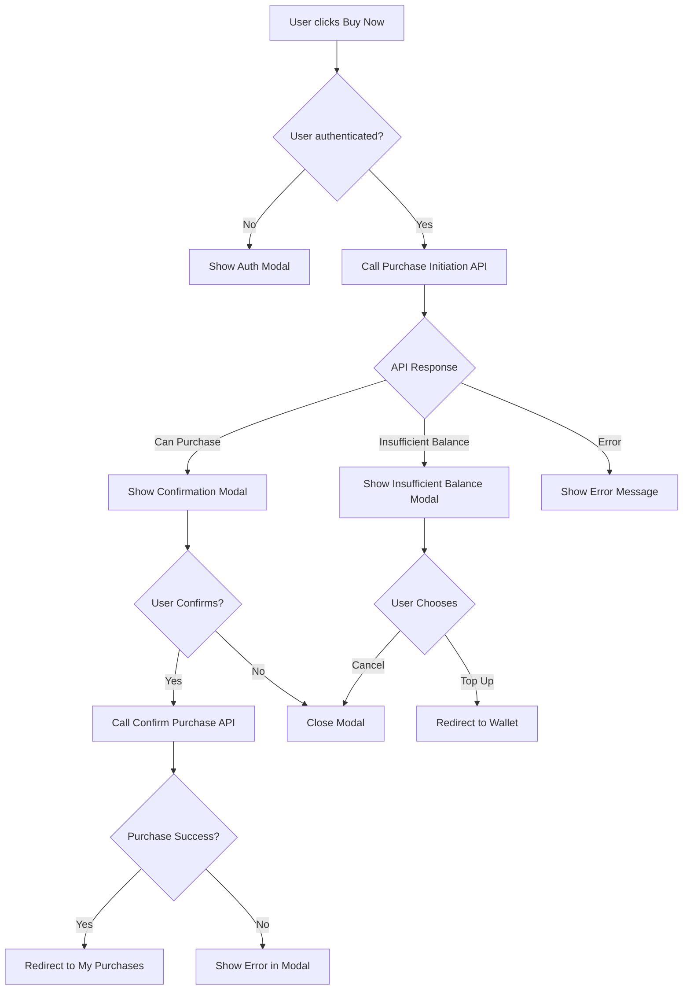
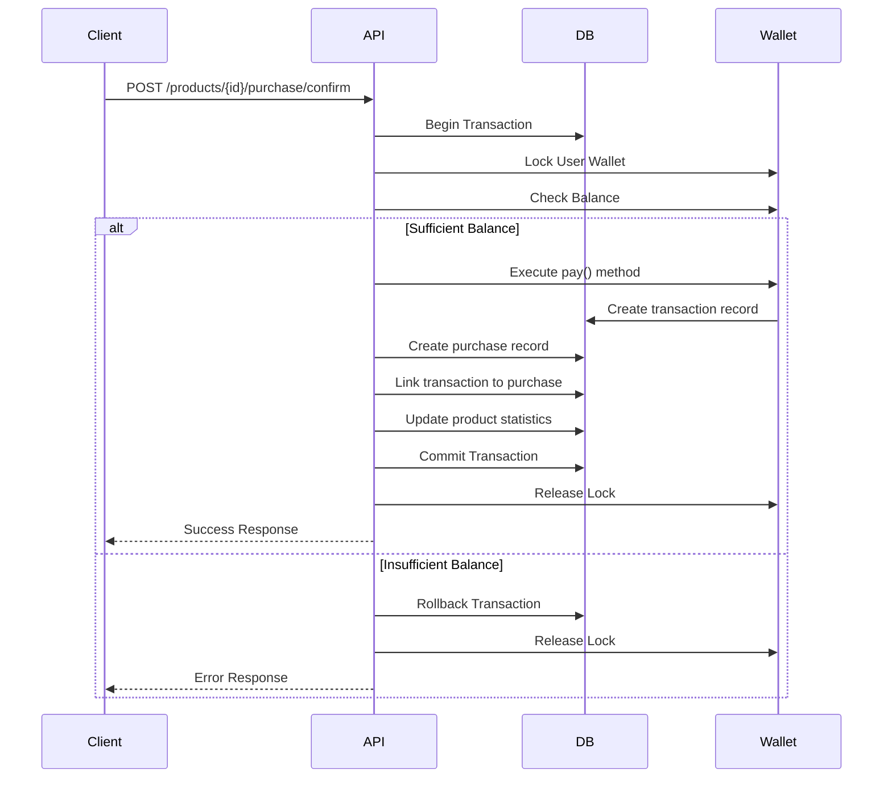

# Purchase Logic Implementation Design

## Overview

This design document outlines the implementation of a product purchase system where users can buy digital products using their wallet balance. The system integrates with Laravel Wallet package to handle monetary transactions and provides a complete purchase workflow including balance validation, purchase confirmation, and post-purchase product access.

## Business Requirements

### Core Functionality

The purchase system must support the following user journey:

1. User views a product and clicks "Buy Now" button
2. System validates user authentication and product availability
3. System checks if user has sufficient balance
4. If balance is sufficient, display confirmation modal with purchase details
5. If balance is insufficient, display modal offering to redirect to wallet top-up page
6. After successful purchase, deduct funds from user wallet and record the purchase
7. Purchased product appears in "My Purchases" page where user can download it

### Business Rules

1. Only authenticated users can purchase products
2. User must have sufficient wallet balance to complete purchase
3. Each purchase creates a permanent transaction record
4. Users can purchase the same product multiple times (digital goods model)
5. Purchase completion triggers product availability in user's library
6. Successful purchase updates product download statistics

## System Components

### Database Structure

#### Product Purchase Relationship

A new pivot table is required to track user purchases:

| Column | Type | Description |
|--------|------|-------------|
| id | bigint (primary key) | Unique purchase identifier |
| user_id | bigint (foreign key) | Reference to users table |
| product_id | bigint (foreign key) | Reference to products table |
| transaction_id | bigint (foreign key, nullable) | Reference to wallet transactions table |
| purchase_price | decimal(10,2) | Price paid at time of purchase |
| purchased_at | timestamp | When purchase was completed |
| created_at | timestamp | Record creation timestamp |
| updated_at | timestamp | Record update timestamp |

**Indexes:**
- Primary key on id
- Index on user_id for efficient user purchase lookups
- Index on product_id for product sales analytics
- Composite index on (user_id, product_id, purchased_at) for purchase history queries

#### Integration with Laravel Wallet

The system leverages existing Laravel Wallet tables:
- **transactions** table: Stores all wallet transactions (deposits/withdrawals)
- **transfers** table: Records transfer operations between wallets
- **wallets** table: Manages user wallet balances

### Model Relationships

#### User Model Enhancements

The User model must establish relationship with purchased products:

**Relationship Definition:**
- Type: Many-to-Many
- Related Model: Product
- Pivot Table: product_user (user purchases)
- Pivot Fields: purchase_price, purchased_at, transaction_id
- Relationship Name: purchasedProducts

**Methods Required:**
- hasPurchased(product): Check if user has purchased specific product
- getPurchaseDate(product): Retrieve when product was purchased
- getPurchasePrice(product): Get the price paid for product

#### Product Model Enhancements

The Product model must implement Laravel Wallet's ProductInterface or ProductLimitedInterface:

**Interface Implementation:**
- Interface: ProductInterface (supports unlimited purchases)
- Required Method: getAmountProduct(customer) - Returns product price in smallest currency unit
- Required Method: getMetaProduct() - Returns transaction metadata

**Relationship Definition:**
- Type: Many-to-Many
- Related Model: User
- Pivot Table: product_user
- Relationship Name: purchasedBy

**Methods Required:**
- getPurchaseCount(): Total number of times product was purchased
- isPurchasedBy(user): Check if specific user purchased product

### Backend Logic Flow

#### Purchase Initiation Endpoint

**Route Definition:**
- Method: POST
- Path: /api/products/{product}/purchase/initiate
- Authentication: Required
- Middleware: auth

**Request Validation:**
- product parameter must be valid Product model instance
- User must be authenticated

**Response Structure:**

Success response when user has sufficient balance:
```
{
  "can_purchase": true,
  "product": {
    "id": number,
    "name": string,
    "price": number,
    "formatted_price": string
  },
  "user_balance": number,
  "formatted_balance": string,
  "remaining_balance": number,
  "formatted_remaining_balance": string
}
```

Insufficient balance response:
```
{
  "can_purchase": false,
  "product": {
    "id": number,
    "name": string,
    "price": number,
    "formatted_price": string
  },
  "user_balance": number,
  "formatted_balance": string,
  "shortfall": number,
  "formatted_shortfall": string
}
```

**Business Logic Steps:**

1. Retrieve authenticated user with wallet relationship
2. Load product with current pricing
3. Get user's current wallet balance
4. Calculate price in wallet currency units (convert to smallest unit)
5. Compare user balance with product price
6. If balance sufficient:
   - Calculate remaining balance after purchase
   - Return success payload with purchase preview
7. If balance insufficient:
   - Calculate shortfall amount
   - Return insufficient balance payload

#### Purchase Confirmation Endpoint

**Route Definition:**
- Method: POST
- Path: /api/products/{product}/purchase/confirm
- Authentication: Required
- Middleware: auth

**Request Validation:**
- product parameter must be valid Product model instance
- User must be authenticated
- User must have sufficient balance (revalidate)

**Response Structure:**

Success response:
```
{
  "success": true,
  "message": string,
  "purchase": {
    "id": number,
    "product_id": number,
    "product_name": string,
    "price_paid": number,
    "purchased_at": timestamp
  },
  "new_balance": number,
  "formatted_balance": string,
  "transaction_uuid": string
}
```

Error response:
```
{
  "success": false,
  "error": string,
  "error_code": string ("insufficient_balance" | "purchase_failed" | "product_unavailable")
}
```

**Business Logic Steps:**

1. Begin database transaction
2. Lock user wallet to prevent race conditions
3. Retrieve fresh user balance
4. Validate balance is still sufficient
5. Execute wallet payment using Laravel Wallet's pay() method
6. Create purchase record in product_user pivot table
7. Link transaction ID to purchase record
8. Increment product's purchase/download count
9. Commit database transaction
10. Return success response with purchase details

**Error Handling:**

If any step fails:
1. Rollback database transaction
2. Release wallet lock
3. Return appropriate error response with error code
4. Log error details for debugging

**Transaction Metadata:**

Store in wallet transaction meta field:
- product_id: Purchased product identifier
- product_name: Product name at time of purchase
- purchase_type: "product_purchase"
- user_id: Purchasing user identifier

#### User Purchases Listing Endpoint

**Route Definition:**
- Method: GET
- Path: /api/user/purchases
- Authentication: Required
- Middleware: auth

**Query Parameters:**
- page: Pagination page number (default: 1)
- per_page: Results per page (default: 15, max: 50)
- sort: Sort order ("recent" | "oldest" | "name")

**Response Structure:**
```
{
  "data": [
    {
      "id": number,
      "product": {
        "id": number,
        "name": string,
        "slug": string,
        "category": string,
        "subcategory": string,
        "image_url": string
      },
      "purchase_price": number,
      "formatted_price": string,
      "purchased_at": timestamp,
      "formatted_date": string,
      "can_download": boolean
    }
  ],
  "meta": {
    "current_page": number,
    "last_page": number,
    "per_page": number,
    "total": number
  }
}
```

**Business Logic Steps:**

1. Retrieve authenticated user
2. Load user's purchased products with pivot data
3. Eager load product relationships (category, subcategory, media)
4. Apply sorting based on query parameter
5. Paginate results
6. Format response with product details and purchase information
7. Return paginated purchase history

#### Product Download Endpoint

**Route Definition:**
- Method: GET
- Path: /api/purchases/{purchase}/download
- Authentication: Required
- Middleware: auth

**Authorization Logic:**
- Verify purchase belongs to authenticated user
- Verify purchase is valid and confirmed

**Response:**
- Returns file download stream for product archive
- Content-Type: application/zip or appropriate file type
- Content-Disposition: attachment with filename

**Business Logic Steps:**

1. Verify user owns the purchase
2. Load product version (latest version)
3. Retrieve archive file from storage
4. Increment download count for product and version
5. Stream file to user browser
6. Record download activity in logs

### Frontend Components

#### Purchase Confirmation Modal

**Component Location:** resources/js/components/purchase-confirmation-modal.tsx

**Props Interface:**
```
{
  product: {
    id: number,
    name: string,
    price: number,
    formattedPrice: string,
    imageUrl?: string
  },
  userBalance: number,
  formattedBalance: string,
  remainingBalance: number,
  formattedRemainingBalance: string,
  open: boolean,
  onOpenChange: (open: boolean) => void,
  onConfirm: () => void,
  isProcessing: boolean
}
```

**Visual Structure:**

Modal displays:
- Product information section:
  - Product thumbnail image
  - Product name
  - Product price with formatted currency
  
- Balance information section:
  - Current balance display
  - Remaining balance after purchase
  - Visual indicator of balance change
  
- Action buttons:
  - Confirm Purchase button (primary action)
  - Cancel button (secondary action)
  
- Loading state during processing
- Success/error feedback after action

**User Interactions:**

1. Modal opens when user clicks "Buy Now"
2. User reviews product and balance information
3. User clicks "Confirm Purchase" to proceed
4. Modal shows loading state during transaction
5. On success: Modal closes and redirects to purchases page
6. On error: Modal displays error message with retry option

#### Insufficient Balance Modal

**Component Location:** resources/js/components/insufficient-balance-modal.tsx

**Props Interface:**
```
{
  product: {
    name: string,
    price: number,
    formattedPrice: string
  },
  userBalance: number,
  formattedBalance: string,
  shortfall: number,
  formattedShortfall: string,
  open: boolean,
  onOpenChange: (open: boolean) => void,
  onTopUp: () => void
}
```

**Visual Structure:**

Modal displays:
- Alert icon indicating insufficient funds
- Clear message explaining the situation
- Product price vs current balance comparison
- Amount needed to complete purchase (shortfall)
- Call-to-action buttons:
  - "Top Up Wallet" button (primary action)
  - "Cancel" button (secondary action)

**User Interactions:**

1. Modal opens when balance check fails
2. User sees clear explanation of funding gap
3. User can choose to:
   - Click "Top Up Wallet" → Redirect to /wallet page
   - Click "Cancel" → Close modal and stay on product page

#### Product Sidebar Enhancement

**Component Location:** resources/js/components/product-sidebar.tsx

**Modifications Required:**

Update "Buy Now" button click handler:

**Current Behavior:**
- Authenticated users: Redirects to homepage
- Unauthenticated users: Opens auth modal

**New Behavior:**
- Unauthenticated users: Opens auth modal (unchanged)
- Authenticated users: Initiates purchase flow
  1. Call purchase initiation endpoint
  2. Based on response:
     - If can_purchase: true → Open purchase confirmation modal
     - If can_purchase: false → Open insufficient balance modal

**State Management:**
- Add loading state during API call
- Add error state for network failures
- Disable button during processing

#### My Purchases Page Enhancement

**Component Location:** resources/js/pages/buys.tsx

**Current State:** Contains mock data placeholders

**Required Changes:**

Replace mock data implementation with:

1. API integration to fetch user purchases
2. Loading state during data fetch
3. Empty state when user has no purchases
4. Purchase cards displaying actual purchase data
5. Pagination controls if needed
6. Error state handling

**Data Flow:**

1. Component mounts
2. Set loading state to true
3. Call GET /api/user/purchases endpoint
4. On success:
   - Update purchases state with response data
   - Set loading state to false
   - Display purchase cards
5. On error:
   - Set error state
   - Display error message
   - Provide retry mechanism

#### Purchase Card Enhancement

**Component Location:** resources/js/components/purchase-card.tsx

**Current State:** Contains mock download functionality

**Required Changes:**

Update download handler to:

1. Set loading state on button
2. Call GET /api/purchases/{id}/download endpoint
3. Handle file download response:
   - Create blob from response
   - Generate download URL
   - Trigger browser download
   - Clean up blob URL
4. Handle errors gracefully
5. Update button state after completion

**Props Addition:**
- purchaseId: Purchase record identifier
- productId: Product identifier
- canDownload: Boolean indicating download availability

### State Management

#### Frontend State Flow

**Product Page Purchase Flow:**



**Session State Requirements:**

- User authentication status
- Current user wallet balance (cached, refreshed on purchase)
- Active modal state (auth | confirmation | insufficient_balance | null)
- Purchase processing state (boolean)
- Last purchase result (for success messages)

#### Backend Transaction Flow

**Purchase Confirmation Transaction:**



### Security Considerations

#### Authorization

1. Purchase endpoints must verify user authentication
2. Download endpoint must verify purchase ownership
3. Purchase confirmation must revalidate balance to prevent race conditions
4. Wallet operations must use database locks to prevent concurrent modification

#### Data Validation

1. Product ID must be validated against database
2. Purchase amount must match current product price
3. User balance verification must happen within locked transaction
4. All monetary calculations must use consistent precision

#### Rate Limiting

Apply rate limiting to purchase endpoints:
- Purchase initiation: 10 requests per minute per user
- Purchase confirmation: 5 requests per minute per user
- Download endpoint: 30 requests per minute per user

### Error Handling Strategy

#### Client-Side Errors

| Error Type | User Message | Recovery Action |
|------------|--------------|-----------------|
| Network Error | "Connection failed. Please check your internet connection." | Retry button |
| Insufficient Balance | "Your balance is insufficient. Top up your wallet to continue." | Redirect to wallet |
| Product Unavailable | "This product is currently unavailable." | Return to shop |
| Purchase Failed | "Purchase could not be completed. Please try again." | Retry button |
| Download Failed | "Download failed. Please try again." | Retry button |

#### Server-Side Errors

| Error Code | HTTP Status | Description | Client Action |
|------------|-------------|-------------|---------------|
| insufficient_balance | 400 | User lacks required funds | Show top-up modal |
| product_not_found | 404 | Product does not exist | Redirect to shop |
| purchase_failed | 500 | Transaction processing error | Show retry option |
| unauthorized | 401 | User not authenticated | Redirect to login |
| wallet_locked | 423 | Wallet in use by another transaction | Show retry after delay |

### Performance Optimization

#### Database Optimization

1. Add composite indexes on product_user table for common queries
2. Use eager loading for product relationships in purchase lists
3. Implement query result caching for product prices (5 minutes TTL)
4. Use database transactions with appropriate isolation levels

#### Frontend Optimization

1. Implement optimistic UI updates for balance display
2. Cache user balance with periodic refresh
3. Preload purchase confirmation modal to reduce interaction delay
4. Use pagination for purchase history to limit data transfer
5. Implement skeleton loading states for better perceived performance

#### File Download Optimization

1. Stream files directly from storage to avoid memory overhead
2. Implement download resume capability for large files
3. Cache product archives at edge locations if applicable
4. Generate temporary signed URLs with expiration for secure downloads

### Monitoring and Analytics

#### Metrics to Track

1. Purchase success rate (successful purchases / attempted purchases)
2. Average purchase completion time
3. Insufficient balance occurrence rate
4. Top-up conversion rate (users who top up after seeing insufficient balance)
5. Download success rate
6. Product purchase frequency
7. Revenue per product
8. User lifetime purchase value

#### Logging Requirements

Log the following events:

1. Purchase initiation with user ID and product ID
2. Purchase confirmation with transaction ID and amount
3. Purchase failures with error codes
4. Balance check results
5. Download requests and completions
6. Wallet lock timeouts
7. Transaction rollbacks with reasons

### Testing Considerations

#### Unit Testing Focus

1. Product model purchase relationship methods
2. User model wallet balance checks
3. Purchase price calculation logic
4. Transaction metadata formatting
5. Download authorization logic

#### Integration Testing Scenarios

1. Complete purchase flow from initiation to confirmation
2. Insufficient balance handling
3. Concurrent purchase attempts by same user
4. Purchase with simultaneous balance changes
5. Download access verification
6. Transaction rollback on failure

#### End-to-End Testing Scenarios

1. User journey: Product view → Purchase → Download
2. User journey: Product view → Insufficient balance → Top-up → Purchase
3. Multiple purchases by same user
4. Purchase history pagination
5. Download multiple purchased products
6. Error recovery flows

### Migration Strategy

#### Database Migration

Create migration for product_user pivot table with appropriate indexes and foreign key constraints. Migration should be reversible.

#### Feature Rollout

1. Deploy backend API endpoints without frontend integration
2. Test endpoints using API testing tools
3. Deploy frontend components with feature flag
4. Enable for test users group
5. Monitor metrics and errors
6. Gradual rollout to all users
7. Remove feature flag after stability confirmed

### Future Enhancements

#### Potential Features

1. Gift purchase capability (buy for another user)
2. Purchase history export
3. Refund system with automatic balance restoration
4. Product bundles with discounted pricing
5. Subscription-based product access
6. Purchase notifications via email
7. Download history tracking
8. License key generation for products
9. Product update notifications for purchased items
10. Wishlist with price drop notifications
