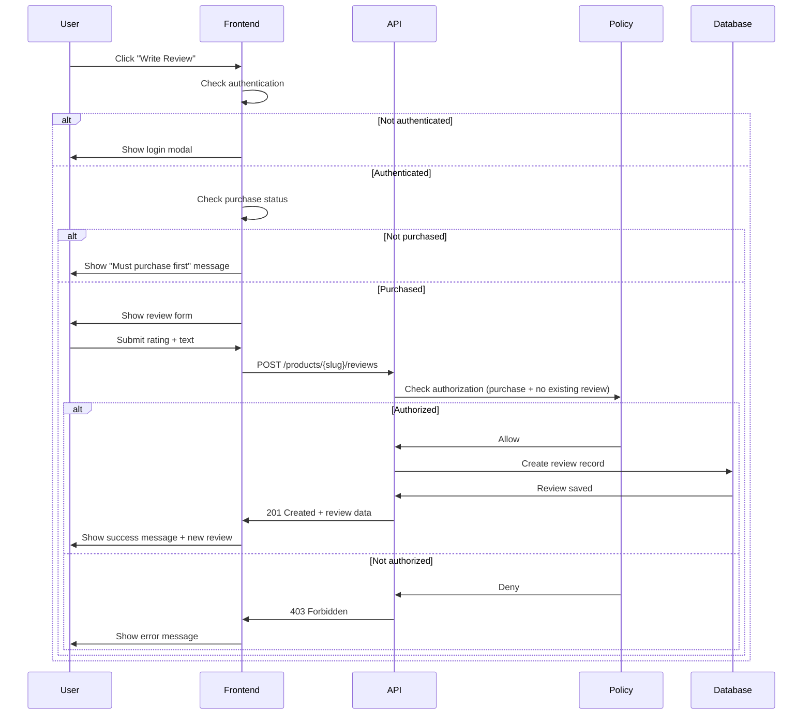
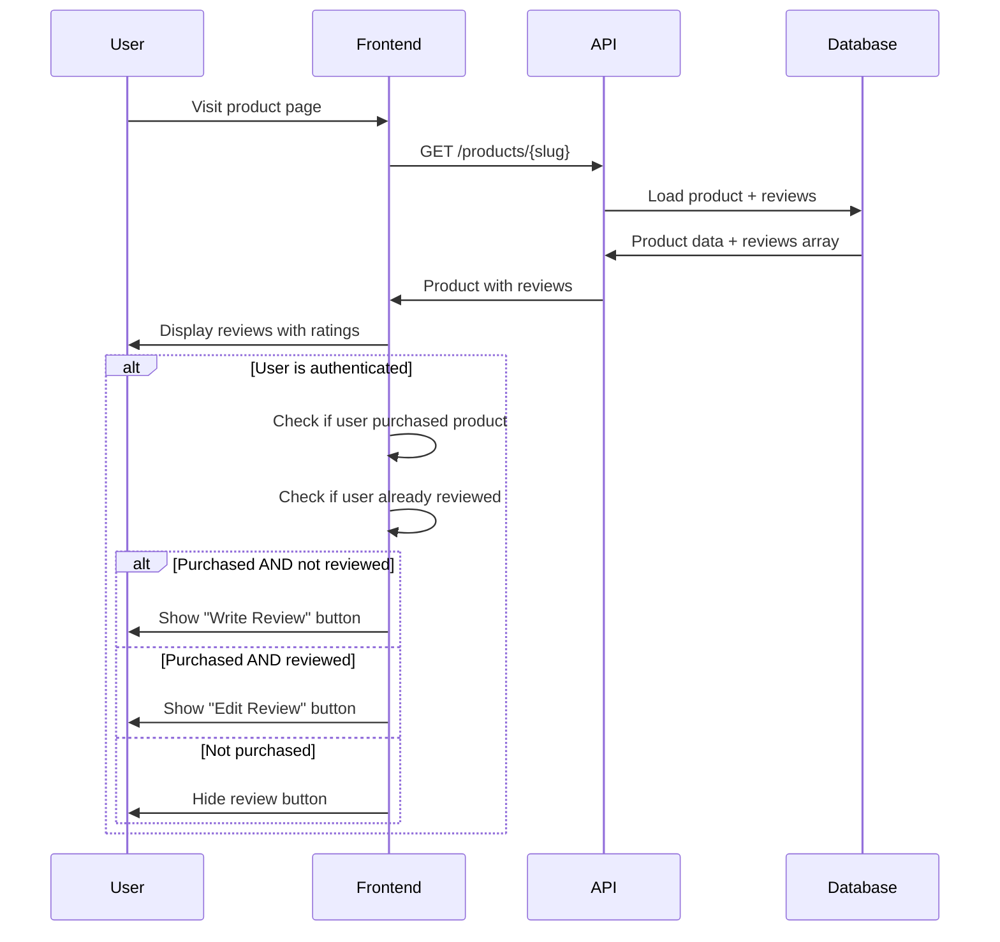

# Review System Integration

## Overview

Integrate the existing ProductReview model into the product display and enable users to submit reviews with purchase verification. The system must enforce that only users who have purchased a product can leave reviews.

## Business Context

The application already has a review model and database structure in place, but it is not actively integrated into the user-facing product pages. This design establishes the connection between product purchases and review submission, ensuring review authenticity by requiring proof of purchase.

## Goals

1. Display existing product reviews on product detail pages
2. Enable authenticated users to submit reviews for purchased products
3. Prevent review submission by users who have not purchased the product
4. Allow users to edit or delete their own reviews
5. Enable administrators to manage reviews through existing permission system

## Current System State

### Existing Components

The following components are already implemented and will be utilized:

| Component | Description | Location |
|-----------|-------------|----------|
| ProductReview Model | Eloquent model with product_id, user_id, rating, review_text | app/Models/ProductReview.php |
| Database Table | product_reviews table with unique constraint on user_id + product_id | database/migrations |
| Product Relationship | Product model has reviews() relationship defined | app/Models/Product.php |
| Policy | ProductReviewPolicy with create and delete authorization | app/Policies/ProductReviewPolicy.php |
| Purchase Tracking | product_user pivot table tracks user purchases | database/migrations |
| Purchase Methods | Product::isPurchasedBy() and User::hasPurchased() methods | Models |
| Frontend Component | product-reviews.tsx component with mock data | resources/js/components |

### Current Limitations

- Reviews are not displayed from the database (component uses mock data)
- No API endpoints exist for review submission, editing, or deletion
- ProductReviewPolicy.create() returns true for all authenticated users (no purchase check)
- Frontend component does not integrate with authentication state or purchase status

## System Design

### Authorization Logic

Purchase-based review authorization will be implemented at multiple layers:

#### Policy Layer

The ProductReviewPolicy will be enhanced to verify purchase status:

| Policy Method | Authorization Rule |
|--------------|-------------------|
| create | User must be authenticated AND have purchased the product |
| update | User must own the review (user_id matches) |
| delete | User must own the review OR have manage-reviews permission |

#### Controller Layer

The review controller will perform validation before accepting review submission:

| Validation Check | Error Response |
|-----------------|----------------|
| User not authenticated | 401 Unauthorized |
| Product not found | 404 Not Found |
| User has not purchased product | 403 Forbidden with message "You must purchase this product before leaving a review" |
| User already reviewed product | 400 Bad Request with message "You have already reviewed this product" |

### Data Flow

#### Review Submission Flow



#### Review Display Flow



### API Endpoints

New endpoints to be created:

| Endpoint | Method | Authentication | Purpose |
|----------|--------|----------------|---------|
| /products/{slug}/reviews | GET | Optional | Retrieve all reviews for a product (paginated) |
| /products/{slug}/reviews | POST | Required | Submit a new review for a product |
| /reviews/{review} | PUT | Required | Update user's own review |
| /reviews/{review} | DELETE | Required | Delete user's own review or admin delete |

#### Endpoint Specifications

**GET /products/{slug}/reviews**

Query Parameters:
- page (integer, default: 1)
- per_page (integer, default: 10, max: 50)
- sort (enum: recent, highest_rating, lowest_rating)

Response Structure:
```
{
  "data": [
    {
      "id": integer,
      "user": {
        "id": integer,
        "name": string,
        "avatar_url": string|null
      },
      "rating": integer (1-5),
      "review_text": string,
      "created_at": timestamp,
      "updated_at": timestamp,
      "can_edit": boolean,
      "can_delete": boolean
    }
  ],
  "meta": {
    "current_page": integer,
    "last_page": integer,
    "per_page": integer,
    "total": integer
  }
}
```

**POST /products/{slug}/reviews**

Request Body:
- rating (required, integer, 1-5)
- review_text (required, string, min: 10, max: 2000)

Validation Rules:
- User must be authenticated
- User must have purchased the product
- User must not have already reviewed this product
- Rating must be between 1 and 5
- Review text must be between 10 and 2000 characters

Response (201 Created):
```
{
  "success": true,
  "message": "Review submitted successfully",
  "review": {
    "id": integer,
    "rating": integer,
    "review_text": string,
    "created_at": timestamp
  }
}
```

**PUT /reviews/{review}**

Request Body:
- rating (optional, integer, 1-5)
- review_text (optional, string, min: 10, max: 2000)

Authorization:
- User must own the review (review.user_id === authenticated user id)

Response (200 OK):
```
{
  "success": true,
  "message": "Review updated successfully",
  "review": {
    "id": integer,
    "rating": integer,
    "review_text": string,
    "updated_at": timestamp
  }
}
```

**DELETE /reviews/{review}**

Authorization:
- User must own the review OR have manage-reviews permission

Response (200 OK):
```
{
  "success": true,
  "message": "Review deleted successfully"
}
```

### Frontend Integration

#### Product Page Modifications

The product detail page will be enhanced to show real review data and enable review submission:

| Component | Modification |
|-----------|-------------|
| product-reviews.tsx | Replace mock data with API call to fetch reviews |
| product-reviews.tsx | Add review submission form with rating selector and text input |
| product-reviews.tsx | Show edit/delete buttons for user's own review |
| product-reviews.tsx | Display purchase requirement message for non-purchasers |
| product.tsx (page) | Pass purchase status and user review data to ProductReviews component |

#### Review Form Specifications

Form Fields:
- Star rating selector (1-5 stars, required)
- Review text area (multiline, 10-2000 characters, required)
- Submit button
- Cancel button (for edit mode)

Form States:
- Initial: Empty form for new review
- Edit mode: Pre-filled with existing review data
- Loading: During submission
- Success: Show confirmation and refresh review list
- Error: Display validation or authorization errors

#### User Experience Scenarios

| User State | UI Behavior |
|-----------|-------------|
| Not authenticated | Reviews visible, "Write Review" button shows login modal |
| Authenticated, not purchased | Reviews visible, "Write Review" button disabled with tooltip "Purchase required" |
| Authenticated, purchased, no review | Reviews visible, "Write Review" button enabled |
| Authenticated, purchased, has review | Reviews visible, "Edit Review" button shown for user's review |

### Database Considerations

Existing schema is sufficient:

| Table | Purpose | Key Constraints |
|-------|---------|----------------|
| product_reviews | Store all reviews | Unique index on (user_id, product_id) prevents duplicate reviews |
| product_user | Track purchases | Used to verify purchase before allowing review |

The unique constraint on (user_id, product_id) ensures one review per user per product at the database level.

### Admin Management

Administrators with manage-reviews permission can:

- Delete any review (existing policy supports this)
- View all reviews in admin panel (future enhancement, not in scope)

The existing permission system does not require modification.

## Security & Validation

### Input Validation

| Field | Validation Rules |
|-------|-----------------|
| rating | Required, integer, minimum: 1, maximum: 5 |
| review_text | Required, string, minimum length: 10, maximum length: 2000 |

### Authorization Checks

Sequential authorization verification:

1. User authentication (middleware level)
2. Product existence verification
3. Purchase verification (Product::isPurchasedBy() method)
4. Duplicate review check (database unique constraint + pre-check)
5. Ownership verification for edit/delete operations

### Error Handling

| Error Type | HTTP Status | User Message |
|-----------|-------------|--------------|
| Not authenticated | 401 | Please log in to submit a review |
| Product not found | 404 | Product not found |
| Not purchased | 403 | You must purchase this product before leaving a review |
| Already reviewed | 400 | You have already reviewed this product. You can edit your existing review. |
| Validation failed | 422 | Please provide a rating between 1-5 and review text (10-2000 characters) |
| Not authorized to edit | 403 | You can only edit your own reviews |
| Server error | 500 | An error occurred while processing your review. Please try again. |

## Success Criteria

The integration will be considered successful when:

1. Product pages display all reviews from the database with user information
2. Users who have purchased a product can successfully submit reviews
3. Users who have not purchased a product cannot submit reviews
4. Users can edit and delete their own reviews
5. The unique constraint prevents duplicate reviews per user per product
6. Administrators can delete any review using existing permissions
7. Frontend provides clear feedback about purchase requirements and review status

## Out of Scope

The following items are explicitly not included in this integration:

- Review voting or helpfulness rating system
- Review media attachments (images/videos)
- Review moderation workflow or flagging system
- Review sorting by helpfulness or votes
- Email notifications for new reviews
- Admin panel interface for review management
- Review analytics or reporting
- Review response feature for product authors

## Technical Dependencies

| Dependency | Usage |
|-----------|--------|
| Laravel Authorization | Policy-based review access control |
| Existing Product Model | isPurchasedBy() method for purchase verification |
| Existing User Model | hasPurchased() method for purchase verification |
| product_user Pivot Table | Purchase history tracking |
| Inertia.js | Server-side to frontend data passing |
| React | Frontend review display and form handling |
| Axios | HTTP requests from frontend to API |

## Implementation Notes

### Controller Structure

A new ReviewController should be created to handle review operations:

- Store method: Validate purchase, check for existing review, create new review
- Update method: Verify ownership, validate input, update review
- Destroy method: Verify ownership or admin permission, delete review
- Index method: Return paginated reviews for a product

### Policy Enhancement

The existing ProductReviewPolicy should be updated:

- create() method: Change from return true to check Product::isPurchasedBy()
- update() method: Add to verify user_id matches authenticated user
- Existing delete() method is already correct

### Frontend State Management

The product-reviews.tsx component should:

- Accept props: productSlug, isPurchased, userReview (if exists)
- Manage local state: reviews list, form data, loading states, error messages
- Handle pagination for review list
- Toggle between view/edit/create modes based on user state

### Route Registration

Routes should be added to web.php in the authenticated middleware group:

- Review submission and modification require authentication
- Review viewing (GET) can be public but may show different UI for authenticated users
